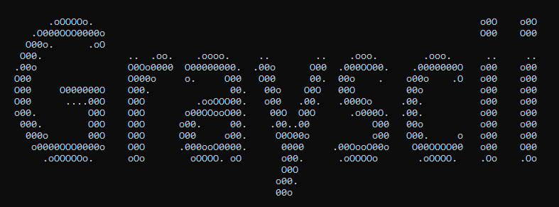

  
Grayscii is a small command line program that converts images to ascii art using user defined character palettes.  

## Dependencies  
To run this program, you will need python 3 (tested on version 3.9.12).  
It also requires the pillow image library, which can be installed using:  
```python -m pip install pillow``` 

## Usage
To convert and print an image in ascii, run:  
```python grayscii.py resources/earring.jpg```  
When printing directly to a terminal, most images will be too large to view properly. Fortunately, the output can be resized using -x and -y:  
```python grayscii.py resources/earring.jpg -x 75 -y 50```  
Custom ascii palettes can be specified with -p:  
```python grayscii.py resources/earring.jpg -x 75 -y 50 -p _-+=#@```  
And the output can be written to a file using -o:  
```python grayscii.py resources/earring.jpg -o earring.txt```  
run ```python grayscii.py -h``` for more detailed usage information.  

## Tests  
To run the unit tests for this program, navigate to tests/ and run ```py tests.py```  

## Credits  
earring.jpg was sourced from [wikipedia](https://simple.wikipedia.org/wiki/Girl_with_a_Pearl_Earring#/media/File:1665_Girl_with_a_Pearl_Earring.jpg)

